# DeskHUD

**A 7-inch Wi-Fi status display for your PC and your coding agents.** It shows CPU, GPU,
memory, network and disks, and what Claude Code, Codex, pi, oh-my-pi or opencode is doing right now: what you asked,
which tools it's running, and when it needs your permission or an answer.

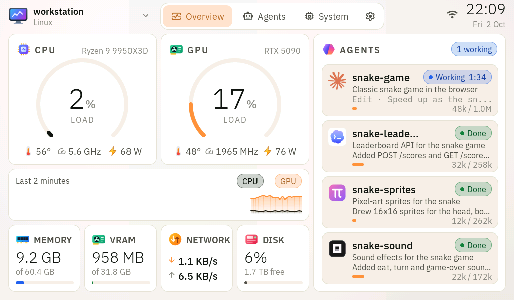

## Why

You can judge me all you want, but I like those LCDs that sit inside fancy cases and on top of
CPU coolers. I wanted something better and cheaper: a bigger screen that sits on the desk where I
can see it, that knows what my coding agents are up to, and that isn't tied to one vendor's app or
one machine.

So this is built on the
[**Waveshare ESP32-S3-Touch-LCD-7B**](https://www.waveshare.com/product/esp32-s3-lcd-7b.htm)
([docs](https://docs.waveshare.net/ESP32-S3-Touch-LCD-7B)). It's a 7" 1024×600 capacitive
touchscreen with an ESP32-S3 (8 MB PSRAM, 16 MB flash) and Wi-Fi on the back. USB is only for
power. Stats, pairing, settings and firmware updates all go over Wi-Fi, and several PCs can
share one display.

<p align="center">
  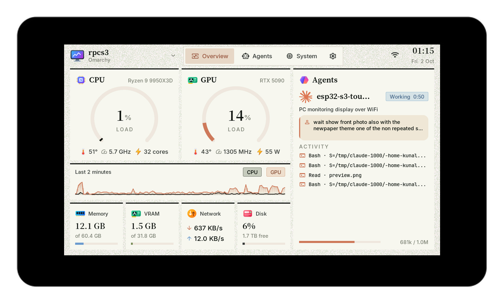<br>
  <sub>The ESP32-S3-Touch-LCD-7B running DeskHUD (Newsprint theme).</sub>
</p>

## Screens

Two themes, **Paper** and **Ink**, set in IBM Plex (more on the device). Tap a screenshot for full size.

**Paper**

<table>
<tr>
<td width="33%" align="center"><a href="docs/screenshots/paper-overview.png"></a><br><sub><b>Overview</b> · stats and every agent at a glance</sub></td>
<td width="33%" align="center"><a href="docs/screenshots/paper-agents.png">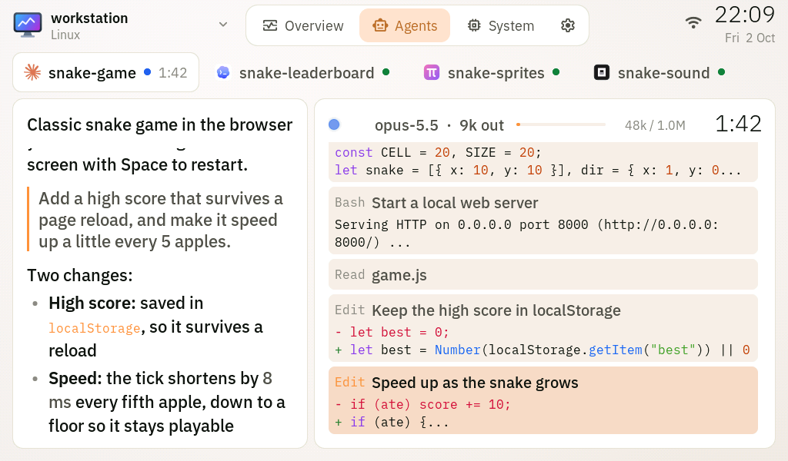</a><br><sub><b>Agents</b> · the conversation and tool calls, live</sub></td>
<td width="33%" align="center"><a href="docs/screenshots/paper-system.png">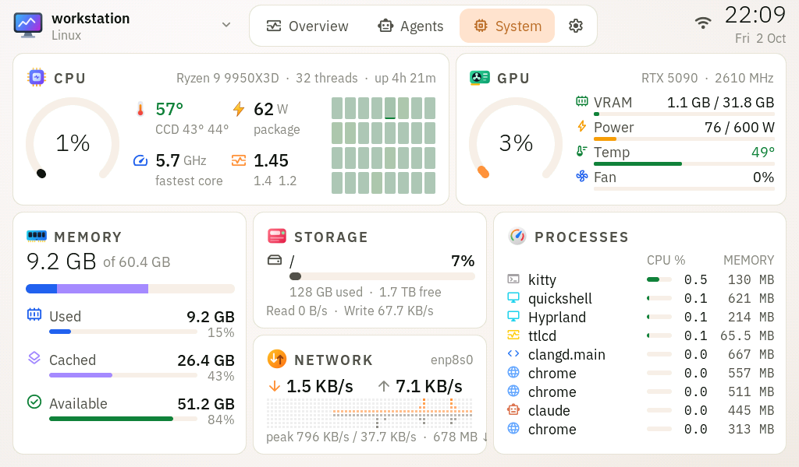</a><br><sub><b>System</b> · btop-style CPU, GPU, memory, disks, network</sub></td>
</tr>
<tr>
<td width="33%" align="center"><a href="docs/screenshots/paper-sysinfo.png">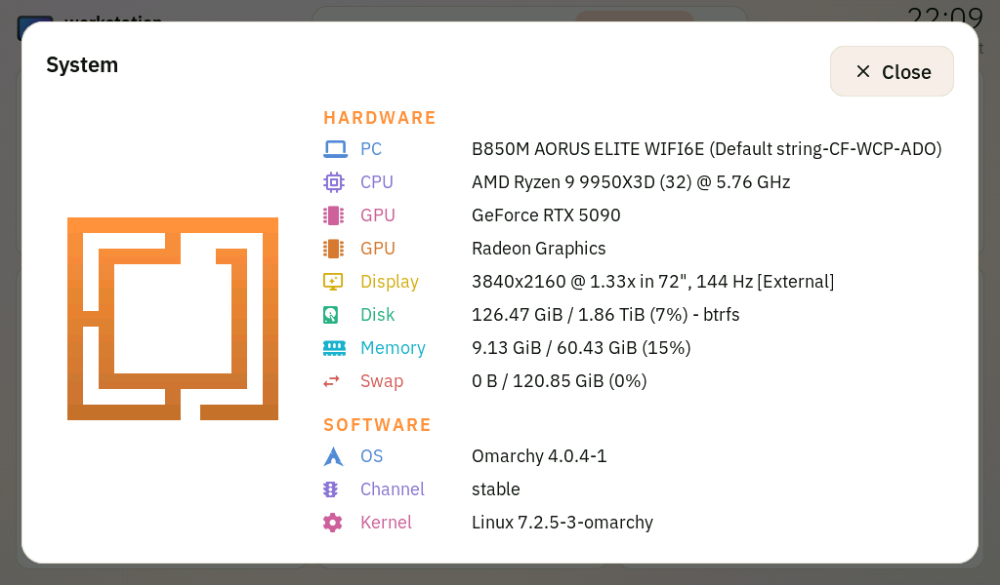</a><br><sub><b>System info</b> · your fastfetch, from the top bar</sub></td>
<td width="33%" align="center"><a href="docs/screenshots/paper-procs.png">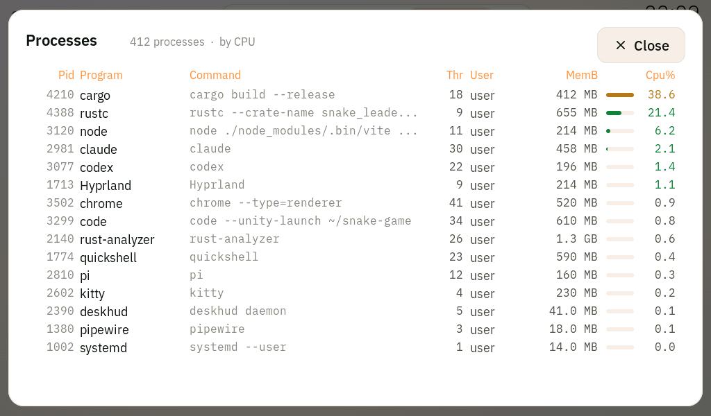</a><br><sub><b>Processes</b> · tap the process list</sub></td>
<td width="33%" align="center"><a href="docs/screenshots/paper-settings.png">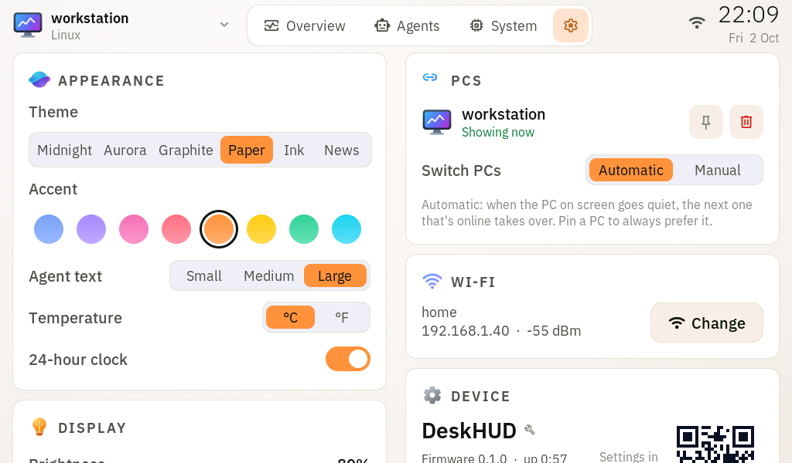</a><br><sub><b>Settings</b> · everything by touch</sub></td>
</tr>
</table>

**Ink**

<table>
<tr>
<td width="33%" align="center"><a href="docs/screenshots/ink-overview.png">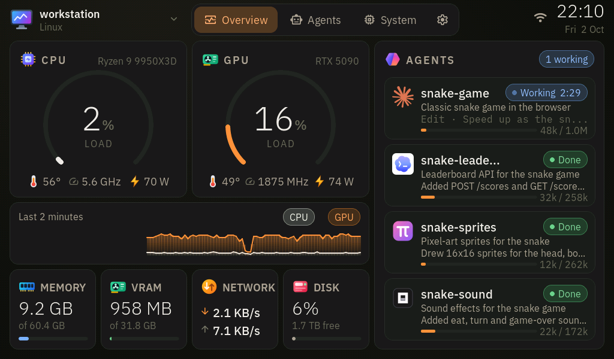</a><br><sub><b>Overview</b> · stats and every agent at a glance</sub></td>
<td width="33%" align="center"><a href="docs/screenshots/ink-agents.png">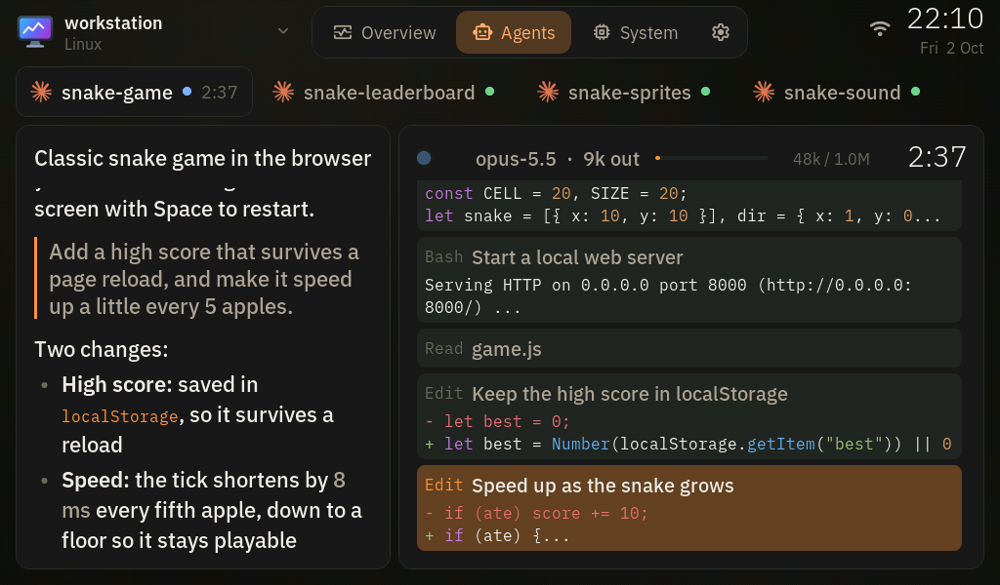</a><br><sub><b>Agents</b> · the conversation and tool calls, live</sub></td>
<td width="33%" align="center"><a href="docs/screenshots/ink-system.png">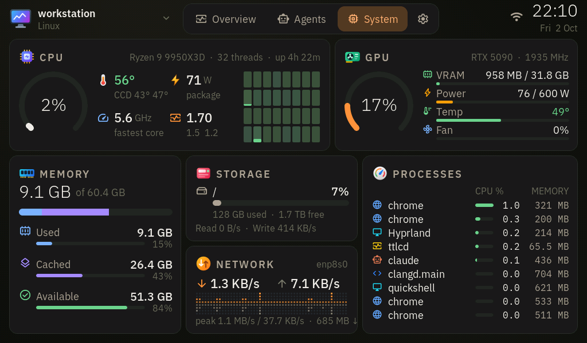</a><br><sub><b>System</b> · btop-style CPU, GPU, memory, disks, network</sub></td>
</tr>
<tr>
<td width="33%" align="center"><a href="docs/screenshots/ink-sysinfo.png">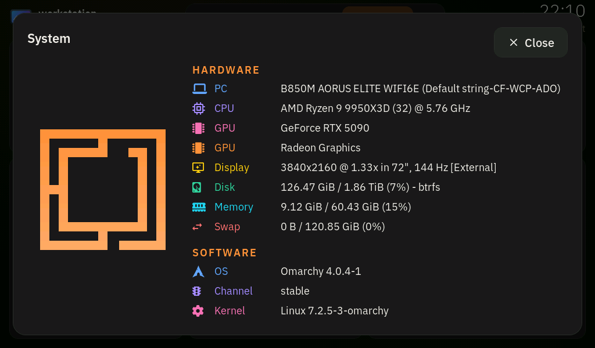</a><br><sub><b>System info</b> · your fastfetch, from the top bar</sub></td>
<td width="33%" align="center"><a href="docs/screenshots/ink-procs.png">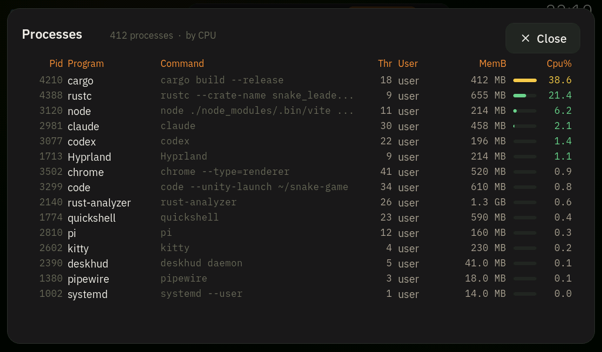</a><br><sub><b>Processes</b> · tap the process list</sub></td>
<td width="33%" align="center"><a href="docs/screenshots/ink-settings.png">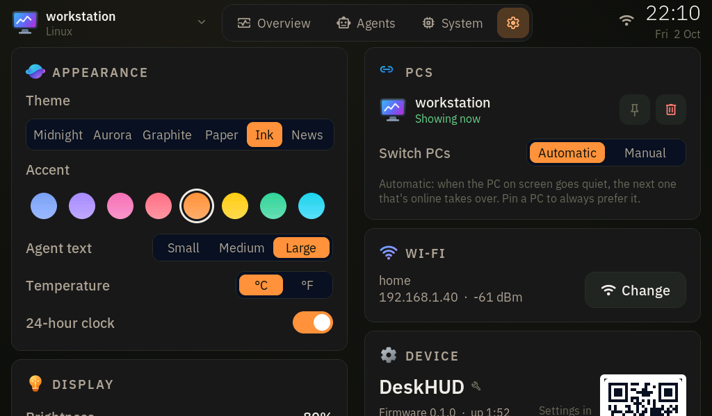</a><br><sub><b>Settings</b> · everything by touch</sub></td>
</tr>
</table>

**Agents**: Claude Code, Codex, pi, oh-my-pi and opencode. Replies render as markdown, edits as
highlighted diffs, and any message or tool call opens in full when tapped. A banner wakes the
screen when an agent needs your permission or an answer.

### Web management

Every setting is also available from a browser at `http://<display-ip>/`; the display's settings
page has a QR code for it. The browser is approved on the touchscreen the same way a PC is, but it
never becomes the data source. You can install firmware updates from here too.

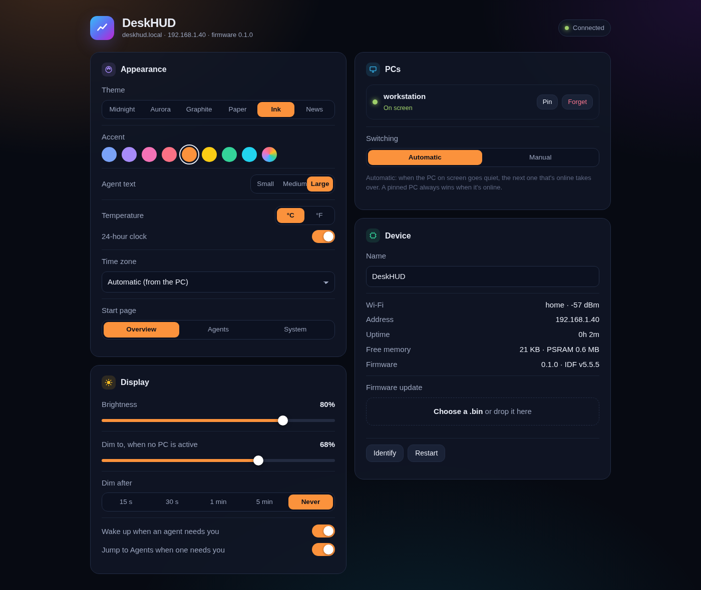

## How it works

```
 PC: monitoring service  ── WebSocket ──▶  display (firmware)  ◀── WebSocket ──  another PC
   stats · coding-agent                     one PC on screen,                    standby; takes
   sessions · CLI                           the rest on standby                  over on failover
```

- **Discovery and pairing**: the display announces itself over mDNS (`_deskhud._tcp`). The first time a PC connects you tap Allow on the screen; after that the PC uses a 256-bit token.
- **Several PCs, one on screen**: if the PC on screen goes quiet for 6 s (sleep, crash, unplugged), the most recently heard standby PC takes over. A clean disconnect hands over in about 0.3 s. A pinned PC always wins when it's online.
- **Agent monitoring**:
  - The monitoring service follows the session logs of Claude Code, Codex, pi and oh-my-pi from their first byte, and reads opencode's session database.
  - Claude Code hooks add what the logs can't show. `deskhud install --hooks` registers `deskhud hook` as an async hook in `~/.claude/settings.json`. On each event (prompt, tool call, permission request, question, finish), Claude runs it. It hands the event to the local service and exits at once, without output or blocking, so a permission prompt or question shows on the display the moment it appears. Without the hooks, states come from the logs alone. `deskhud uninstall` removes them.
  - Messages you type while an agent is working show up too.
  - The display keeps a short version of everything; when you tap a message or tool call, it asks the PC for the full text, which the service reads from the agent's log (or opencode's database) on the spot.
- **Clock**: the display follows the time zone of the PC on screen (or a fixed one, set on the web page).
- **Firmware updates over Wi-Fi**: `deskhud ota` or the web page writes the inactive flash slot. A new build that doesn't reach Wi-Fi within 2 minutes is rolled back automatically.

| Path | What |
|---|---|
| `firmware/` | ESP-IDF 5.5 + LVGL 9 firmware |
| `monitor/` | the monitoring service: a Rust daemon and CLI (`deskhud`) that runs on each PC, see [monitor/README.md](monitor/README.md) |
| `docs/PROTOCOL.md` | wire protocol, settings, active-PC rules, HTTP API |
| `docs/screenshots/` | the images above, captured from the device |

## Case and stand

If you want to put it on a desk or a wall, there's a 3D-printable case with an optional stand on
MakerWorld:
[**Waveshare ESP32-S3-Touch-LCD-7B case + stand**](https://makerworld.com/en/models/3383231-waveshare-esp32-s3-touch-lcd-7b-case-stand#profileId-3849570).

- **Fit**: designed from Waveshare's official 3D model for the touch version (192.96 × 110.76 mm glass). The glass sits flush in a pocket, and the display is held by its own metal bracket.
- **Openings**:
  - both USB-C ports, so power works with the case closed;
  - pinholes for BOOT, RESET and the UART switch (use a paperclip);
  - a slot for the HY2.0 headers;
  - a micro-SD window.
- **Extras**: vents, two keyholes for wall mounting, room for a thin LiPo, and a desk stand that tilts the display back 20°.
- **You need**: 4 × M3 × 6 mm screws with heads up to 6 mm across, and a screwdriver with a shaft narrower than 6 mm.
- **Printing**: PLA at 0.2 mm layers, 3 walls, 15% infill, no supports.

> ⚠️ Don't use screws longer than 6 mm. There's only about 2.5 mm of space behind the bracket tabs before the back of the LCD panel.

## Setup

```bash
# 1. Toolchain (once): ESP-IDF v5.5.5 in ~/esp, Python 3.12 venv
cd firmware && . ./env.sh

# 2. Flash over USB (once; later updates go over Wi-Fi)
idf.py -p /dev/ttyACM0 flash

# 3. Wi-Fi: tap "Set up Wi-Fi" on the display, or use the USB console (115200 baud):
#      wifi "<ssid>" "<password>"        (also: status, pcs, forget, reboot)

# 4. Monitoring service: systemd user service + Claude Code hooks, then tap Allow on the display
cd ../monitor && cargo install --path . && deskhud install --hooks
```

On Linux the board's USB serial port (a CH343) needs access for your user, for example a udev
rule with `TAG+="uaccess"` for `1a86:55d3`.

## Day to day

```bash
deskhud status                       # connection, role, sessions being sent
deskhud set theme=ink accent=#cc785c brightness=80
deskhud notify "Build done" "release in 41 s"
deskhud activate --pin               # keep this PC on screen whenever it's online
deskhud page agents                  # switch the display's page (sysinfo / procs open the popups)
deskhud sysinfo                      # the system info and process table the popups show
deskhud demo on                      # screenshot mode: sample sessions, placeholder names and addresses
firmware/tools/deploy.sh             # build and install firmware over Wi-Fi
firmware/tools/screenshot.sh shot.png
```

## Firmware notes

- **Display path**: RGB565 at a 30 MHz pixel clock with a short vertical sync (about 35 Hz scan; at 26 Hz dark themes flickered), with 20-line bounce buffers in SRAM. LVGL runs in double-buffered direct mode in PSRAM.
- **Memory**:
  - flash and PSRAM both run at 120 MHz; at 80 MHz the panel shakes under load;
  - code and read-only data execute from PSRAM, so flash writes (OTA, settings) never stall the panel;
  - LVGL's heap lives in PSRAM, which leaves internal RAM for Wi-Fi.
- **Rendering cost**: a full-screen redraw takes about 150–190 ms because the panel's DMA shares PSRAM bandwidth. So pages switch in a single frame, charts are cached images redrawn once a second, and live updates only redraw what changed.
- **Text**: agent replies are markdown, rendered on the device by a small parser for the subset agents write (`main/ui/md.c`: headings, bold, italic, code, code blocks, lists, quotes, links, tables). Code is highlighted by a one-pass tokenizer (`main/ui/hl.c`) with keyword lists for C/C++, Rust, Python, JS/TS, Go, shell, JSON and config files; edits show as diffs. Both lay text out once, when it changes.
- **Assets**: `tools/gen_fonts.sh` builds the fonts (IBM Plex, Inter and their semibold weights, JetBrains Mono, Source Serif), the Material Symbols icons, and the Nerd Font icons fastfetch uses (from JetBrainsMono Nerd Font). `tools/gen_images.py` rasterizes the SVG icons in `assets/svg` (Microsoft Fluent color icons, brand marks, custom hardware art) and the gauge textures.
- **Screenshots**: `firmware/tools/screenshot.sh` reads the frame buffer over Wi-Fi. `firmware/tools/web_screenshot.sh` renders the web page with the display's live settings.

## References

- [Waveshare ESP32-S3-Touch-LCD-7B docs](https://docs.waveshare.net/ESP32-S3-Touch-LCD-7B): schematics, sample code, and links to the datasheets for the ST7262 panel driver, GT911 touch controller, CH343 USB-serial bridge and TJA1051 CAN transceiver
- [ESP32-S3 datasheet](https://www.espressif.com/sites/default/files/documentation/esp32-s3_datasheet_en.pdf)

## License

[Apache License 2.0](LICENSE). Bundled fonts, icons and brand marks keep their own licenses; see
[THIRD_PARTY_NOTICES.md](THIRD_PARTY_NOTICES.md).
